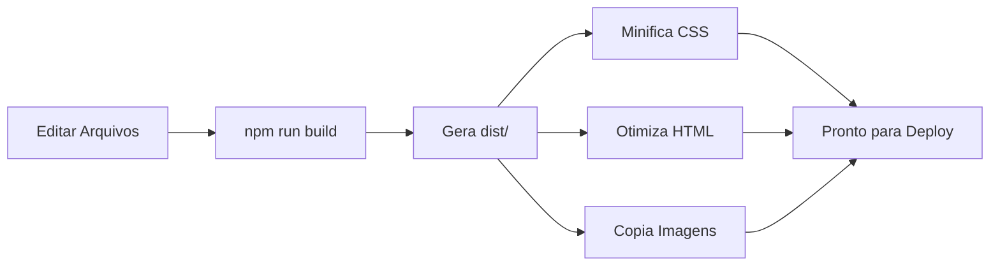

# 🤖 AI Agent - Startup Instructions

Este arquivo é lido automaticamente pela IA quando o projeto é iniciado.

## 📖 LEIA PRIMEIRO: Arquivos de Referência

Sempre que este projeto for aberto, a IA deve ler na seguinte ordem:

### 1️⃣ Contexto do Projeto
```
README.md → Visão geral e quick start
```

### 2️⃣ Instruções Específicas para IA
```
.copilot-instructions.md → Padrões, estrutura e melhores práticas
```

### 3️⃣ Guidelines Detalhados
```
GUIDELINES.md → Workflow, design, arquitetura e deploy
```

---

## 🎯 Objetivo do Projeto

**Site oficial da xCor.Eng**
- Design minimalista (fundo preto, texto branco)
- Node.js puro (zero dependências)
- Performance otimizada
- Build automatizado

---

## 🔑 Informações Chave

### Design
- **Cores**: Preto (#000000) + Branco (#FFFFFF)
- **Logo**: `img/Logo.png` (ao lado do texto)
- **Título**: "xCor.Eng" (50px)
- **Slogan**: "Be Better Than Yesterday" (24px)
- **E-mail**: "abrandaol@xcoreng.com" (14px)

### Estrutura
```
Arquivos Fonte (editar):
├── index.html → Estrutura
├── style.css → Estilos
└── server.js → Servidor

Arquivos de Build:
├── build.js → Script de build
└── package.json → Configurações

Pasta de Produção (gerada):
└── dist/ → Não editar manualmente
```

### Comandos Principais
```bash
npm start       # Desenvolvimento
npm run build   # Gerar dist/
npm run rebuild # Limpar e gerar
```

---

## ⚡ Regras Importantes

### ✅ SEMPRE FAZER
1. Editar arquivos na **raiz** (não em dist/)
2. Executar `npm run build` após mudanças
3. Manter design minimalista
4. Usar apenas Node.js nativo
5. Testar no navegador antes de commitar

### ❌ NUNCA FAZER
1. Editar arquivos em `dist/` manualmente
2. Adicionar dependências npm sem necessidade
3. Mudar cores sem aprovação
4. Quebrar o layout centralizado
5. Usar frameworks CSS/JS externos

---

## 🧠 Contexto para Resolução de Problemas

### Se a página não carregar:
1. Verificar se o servidor está rodando (porta 3000)
2. Conferir se `img/Logo.png` existe
3. Validar paths no HTML/CSS
4. Verificar console do navegador

### Se o build falhar:
1. Verificar se arquivos fonte existem
2. Confirmar sintaxe do HTML/CSS
3. Rodar `npm run clean` e tentar novamente

### Se o layout quebrar:
1. Revisar CSS (especialmente flexbox)
2. Confirmar cores (preto e branco)
3. Verificar tamanhos de fonte
4. Testar responsividade

---

## 📦 Workflow de Build



---

## 🔄 Ciclo de Desenvolvimento

1. **Desenvolvimento**
   ```bash
   npm start  # Servidor dev na porta 3000
   ```

2. **Fazer Alterações**
   - Editar `index.html`, `style.css` ou `server.js`
   - Testar no navegador (http://localhost:3000)

3. **Build**
   ```bash
   npm run build  # Gera dist/
   ```

4. **Testar Produção**
   ```bash
   cd dist && node server.js
   ```

5. **Deploy**
   - Fazer upload da pasta `dist/`
   - Executar servidor no ambiente de produção

---

## 📊 Métricas de Qualidade

### Performance
- ✅ Carregamento < 1 segundo
- ✅ CSS minificado < 1KB
- ✅ HTML otimizado < 500 bytes
- ✅ Zero dependências

### Código
- ✅ Semântico e clean
- ✅ Comentado quando necessário
- ✅ Indentação consistente (4 espaços)
- ✅ Seguir padrões ES6+

---

## 🆘 Comandos de Emergência

### Resetar Tudo
```bash
npm run clean
rm -rf node_modules
npm install
npm run build
```

### Verificar Estado
```bash
# Ver arquivos gerados
ls -la dist/

# Ver tamanhos
cat dist/build-info.json

# Testar servidor
curl http://localhost:3000
```

### Debug
```bash
# Logs do servidor
npm start

# Verificar porta
netstat -ano | findstr :3000  # Windows
lsof -i :3000                  # Mac/Linux
```

---

## 🎓 Aprendizado Contínuo

### Sempre Lembrar
- **Minimalismo**: Menos é mais
- **Performance**: Cada byte conta
- **Simplicidade**: Código claro > código complexo
- **Slogan**: Be Better Than Yesterday

### Documentação Adicional
- `README.md`: Overview completo
- `GUIDELINES.md`: Guidelines detalhados
- `.copilot-instructions.md`: Instruções para IA
- `dist/build-info.json`: Métricas do build

---

## 📞 Suporte

**E-mail**: abrandaol@xcoreng.com  
**GitHub**: https://github.com/xCoreng/site

---

**🤖 Instruções carregadas com sucesso!**  
*A IA está pronta para trabalhar no projeto xCor.Eng*

---

*Última atualização: 2026-02-23*  
*Versão: 1.0.0*
